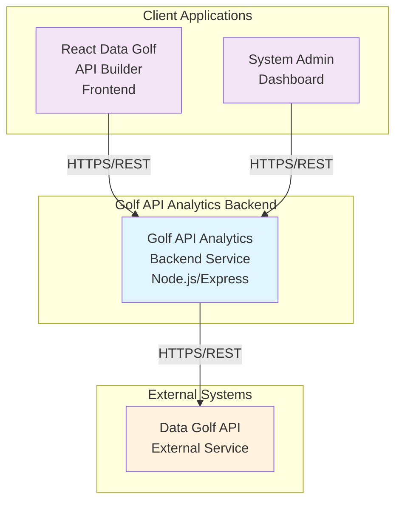
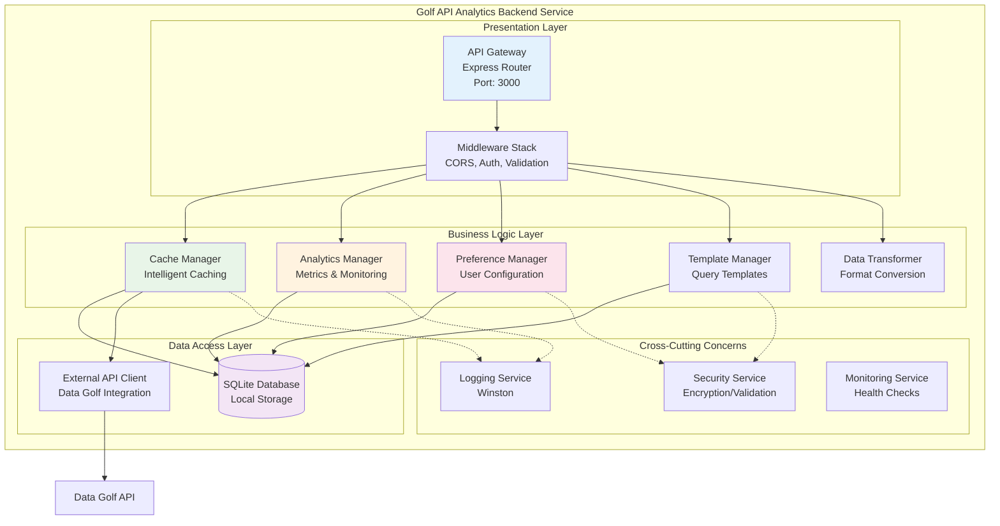
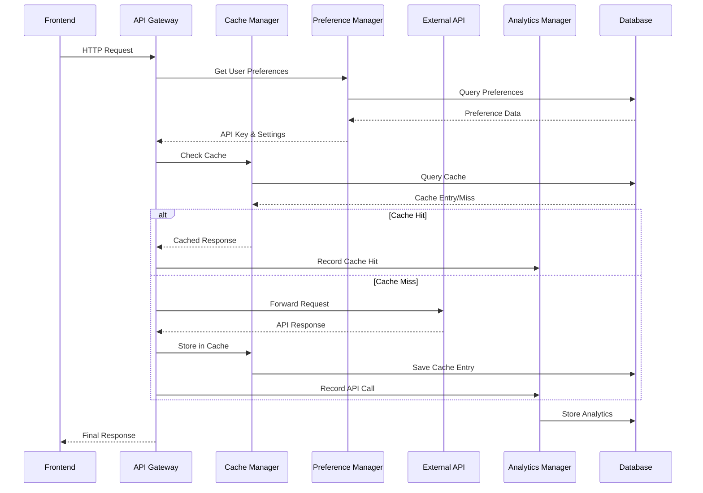
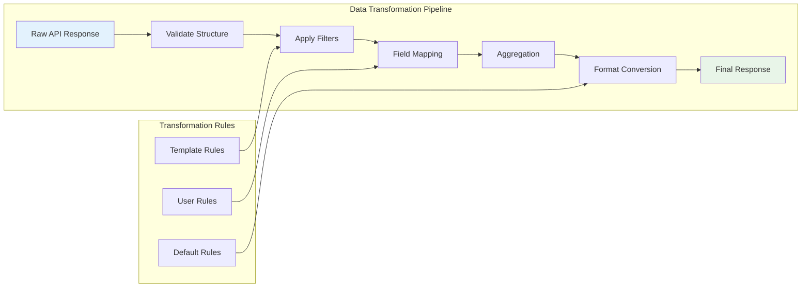
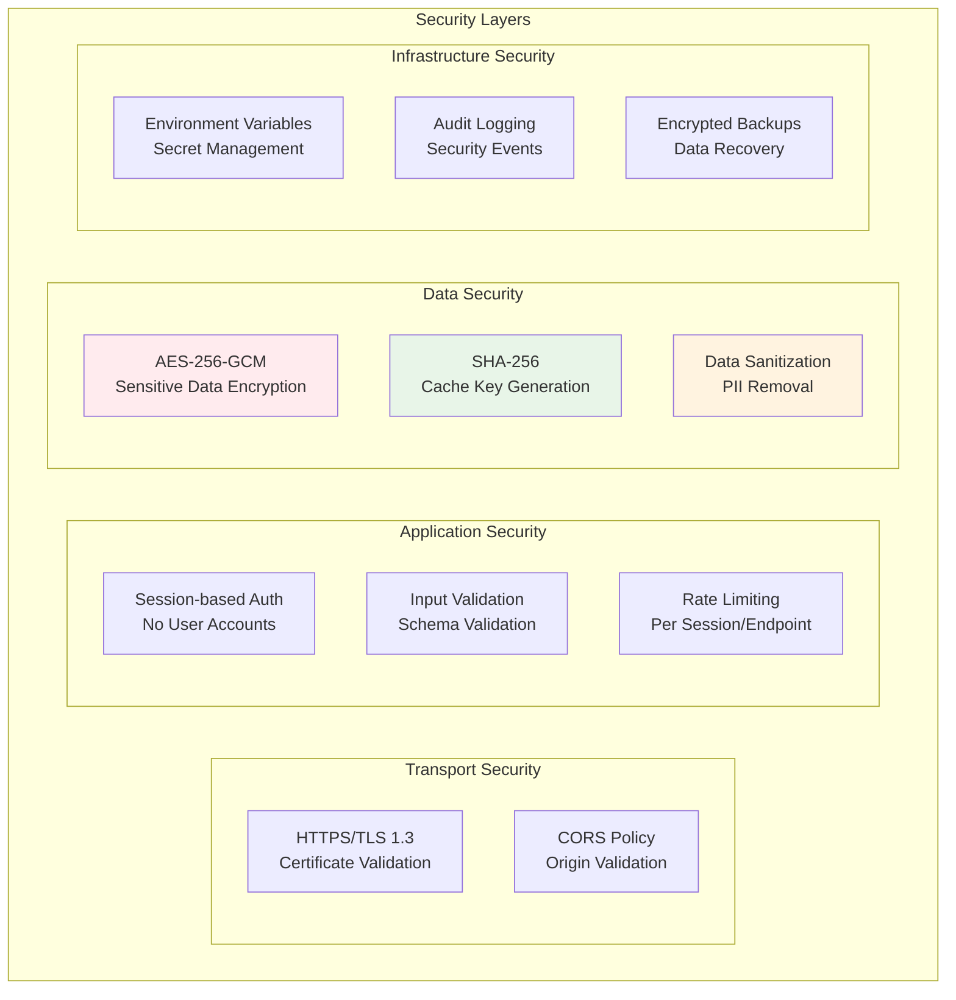
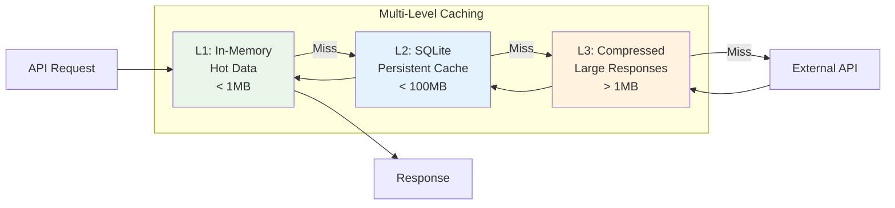
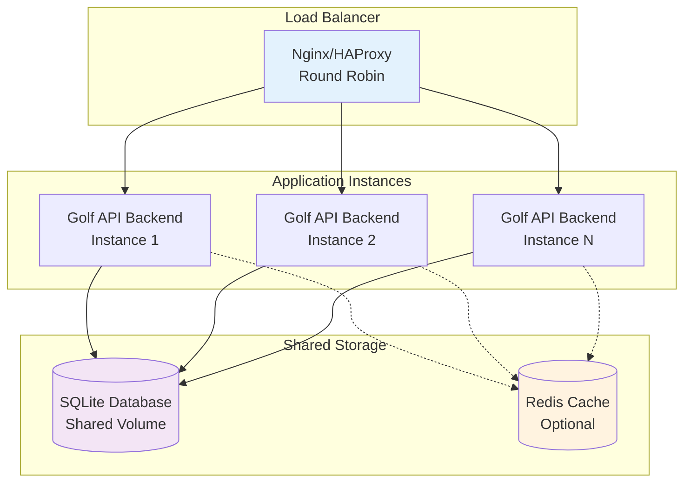

# Golf API Analytics Backend Service - System Architecture

## Architecture Overview

The Golf API Analytics Backend Service implements a **layered architecture** with clear separation of concerns, designed for scalability, maintainability, and integration with the existing React frontend. The system acts as an intelligent proxy between the frontend and Data Golf API, providing caching, analytics, user preferences, and data transformation capabilities.

## System Context Diagram



## Container Architecture



## Component Architecture

### 1. API Gateway Layer

**Responsibility**: Request routing, validation, authentication, and response formatting

```typescript
interface APIGatewayComponent {
  // Core request processing
  processRequest(request: HTTPRequest): Promise<HTTPResponse>
  validateRequest(request: HTTPRequest): ValidationResult
  routeRequest(request: HTTPRequest): RouteTarget

  // Session management
  createSession(clientInfo: ClientInfo): Session
  validateSession(sessionId: string): boolean

  // Rate limiting
  checkRateLimit(sessionId: string, endpoint: string): boolean
  updateRateLimit(sessionId: string, endpoint: string): void
}
```

**Dependencies**:
- Session Manager (for user session handling)
- Rate Limiter (for traffic control)
- Request Validator (for input validation)

### 2. Cache Management Layer

**Responsibility**: Intelligent API response caching with TTL management and LRU eviction

```typescript
interface CacheManagerComponent {
  // Cache operations
  getCachedResponse(cacheKey: string): Promise<CacheEntry | null>
  storeCacheEntry(key: string, data: any, ttl: number): Promise<boolean>
  invalidateCache(pattern: string): Promise<number>

  // Cache optimization
  calculateTTL(endpoint: string, dataSize: number): number
  evictLRUEntries(): Promise<number>
  compressData(data: any): CompressedData

  // Cache monitoring
  getCacheStatistics(): CacheStats
  monitorCacheHealth(): HealthMetrics
}
```

**Dependencies**:
- Database Layer (for persistent storage)
- Compression Service (for data optimization)
- Configuration Service (for TTL settings)

### 3. Analytics Management Layer

**Responsibility**: Request tracking, metrics collection, and real-time monitoring

```typescript
interface AnalyticsManagerComponent {
  // Event recording
  recordAnalyticsEvent(event: AnalyticsEvent): Promise<void>
  updateRealTimeMetrics(eventType: string, data: any): void

  // Data aggregation
  aggregateAnalyticsData(timeRange: TimeRange, granularity: string): AggregatedData
  generateReport(reportType: string, parameters: any): Report

  // Monitoring
  checkPerformanceThresholds(): AlertStatus[]
  triggerAlert(alertType: string, data: any): void
}
```

**Dependencies**:
- Database Layer (for metrics storage)
- Alert Service (for threshold monitoring)
- Time Series Processor (for aggregation)

### 4. User Preference Management Layer

**Responsibility**: Secure storage and retrieval of user preferences and API keys

```typescript
interface PreferenceManagerComponent {
  // Preference operations
  storePreference(sessionId: string, type: string, key: string, value: any): Promise<boolean>
  getPreference(sessionId: string, type: string, key: string): Promise<any>
  getUserPreferences(sessionId: string, types: string[]): Promise<PreferenceMap>

  // Security
  encryptSensitiveData(data: any, sessionId: string): string
  decryptSensitiveData(encryptedData: string, sessionId: string): any

  // Session management
  cleanupExpiredPreferences(): Promise<number>
}
```

**Dependencies**:
- Encryption Service (for data security)
- Database Layer (for persistent storage)
- Session Manager (for lifecycle management)

### 5. Template Management Layer

**Responsibility**: Query template creation, validation, and execution

```typescript
interface TemplateManagerComponent {
  // Template operations
  createTemplate(sessionId: string, template: QueryTemplate): Promise<string>
  executeTemplate(templateId: string, overrides: any): Promise<APIResponse>
  getTemplates(sessionId: string, includePublic: boolean): Promise<QueryTemplate[]>

  // Validation
  validateTemplate(template: QueryTemplate): ValidationResult
  validateParameters(endpoint: string, parameters: any): ValidationResult

  // Sharing
  shareTemplate(templateId: string, isPublic: boolean): Promise<boolean>
}
```

**Dependencies**:
- API Gateway (for request execution)
- Preference Manager (for ownership tracking)
- Validation Service (for parameter checking)

### 6. Data Transformation Layer

**Responsibility**: Response data filtering, formatting, and conversion

```typescript
interface DataTransformerComponent {
  // Transformation pipeline
  applyTransformations(data: any, rules: TransformationRule[]): TransformationResult

  // Specific transformations
  filterData(data: any, filterConfig: FilterConfig): any
  formatData(data: any, targetFormat: string, options: any): string
  aggregateData(data: any, aggregationConfig: AggregationConfig): any

  // Format conversion
  convertToCSV(data: any, options: CSVOptions): string
  convertToXML(data: any, options: XMLOptions): string
}
```

**Dependencies**:
- Format Converters (for output formatting)
- Validation Service (for rule validation)

## Data Flow Architecture

### Primary Request Flow



### Data Transformation Flow



## Database Schema Design

### Core Tables

```sql
-- User Sessions
CREATE TABLE user_sessions (
    session_id TEXT PRIMARY KEY,
    ip_address TEXT NOT NULL,
    user_agent TEXT,
    created_at INTEGER NOT NULL,
    last_accessed_at INTEGER NOT NULL,
    expires_at INTEGER NOT NULL,
    is_active BOOLEAN DEFAULT 1,
    metadata TEXT -- JSON
);

-- API Requests
CREATE TABLE api_requests (
    request_id TEXT PRIMARY KEY,
    session_id TEXT NOT NULL,
    endpoint TEXT NOT NULL,
    method TEXT NOT NULL,
    parameters TEXT, -- JSON
    timestamp INTEGER NOT NULL,
    response_status INTEGER,
    response_time INTEGER,
    cache_hit BOOLEAN DEFAULT 0,
    error_message TEXT,
    data_size INTEGER,
    FOREIGN KEY (session_id) REFERENCES user_sessions(session_id)
);

-- Cache Entries
CREATE TABLE cache_entries (
    cache_key TEXT PRIMARY KEY,
    endpoint TEXT NOT NULL,
    parameters TEXT, -- JSON
    response_data BLOB, -- Compressed
    content_type TEXT,
    created_at INTEGER NOT NULL,
    expires_at INTEGER NOT NULL,
    last_accessed_at INTEGER NOT NULL,
    hit_count INTEGER DEFAULT 0,
    data_size INTEGER,
    compressed_size INTEGER,
    is_valid BOOLEAN DEFAULT 1
);

-- User Preferences
CREATE TABLE user_preferences (
    preference_id TEXT PRIMARY KEY,
    session_id TEXT NOT NULL,
    preference_type TEXT NOT NULL,
    preference_key TEXT NOT NULL,
    preference_value TEXT, -- Encrypted if sensitive
    is_encrypted BOOLEAN DEFAULT 0,
    created_at INTEGER NOT NULL,
    updated_at INTEGER NOT NULL,
    expires_at INTEGER,
    is_active BOOLEAN DEFAULT 1,
    FOREIGN KEY (session_id) REFERENCES user_sessions(session_id)
);

-- Query Templates
CREATE TABLE query_templates (
    template_id TEXT PRIMARY KEY,
    session_id TEXT NOT NULL,
    template_name TEXT NOT NULL,
    description TEXT,
    endpoint TEXT NOT NULL,
    parameters TEXT, -- JSON
    transformations TEXT, -- JSON array
    is_public BOOLEAN DEFAULT 0,
    created_at INTEGER NOT NULL,
    updated_at INTEGER NOT NULL,
    usage_count INTEGER DEFAULT 0,
    is_active BOOLEAN DEFAULT 1,
    FOREIGN KEY (session_id) REFERENCES user_sessions(session_id)
);

-- Analytics Events
CREATE TABLE analytics_events (
    event_id TEXT PRIMARY KEY,
    session_id TEXT,
    event_type TEXT NOT NULL,
    event_name TEXT NOT NULL,
    timestamp INTEGER NOT NULL,
    endpoint TEXT,
    duration INTEGER,
    event_data TEXT, -- JSON
    metadata TEXT, -- JSON
    FOREIGN KEY (session_id) REFERENCES user_sessions(session_id)
);
```

### Indexes for Performance

```sql
-- Session indexes
CREATE INDEX idx_sessions_active ON user_sessions(is_active, expires_at);
CREATE INDEX idx_sessions_ip ON user_sessions(ip_address, created_at);

-- Request indexes
CREATE INDEX idx_requests_session_time ON api_requests(session_id, timestamp);
CREATE INDEX idx_requests_endpoint ON api_requests(endpoint, timestamp);
CREATE INDEX idx_requests_status ON api_requests(response_status, timestamp);

-- Cache indexes
CREATE INDEX idx_cache_endpoint ON cache_entries(endpoint, expires_at);
CREATE INDEX idx_cache_expiry ON cache_entries(expires_at, is_valid);
CREATE INDEX idx_cache_access ON cache_entries(last_accessed_at, hit_count);

-- Preference indexes
CREATE INDEX idx_preferences_session_type ON user_preferences(session_id, preference_type);
CREATE INDEX idx_preferences_active ON user_preferences(is_active, expires_at);

-- Template indexes
CREATE INDEX idx_templates_session ON query_templates(session_id, is_active);
CREATE INDEX idx_templates_public ON query_templates(is_public, is_active);

-- Analytics indexes
CREATE INDEX idx_analytics_type_time ON analytics_events(event_type, timestamp);
CREATE INDEX idx_analytics_session_time ON analytics_events(session_id, timestamp);
CREATE INDEX idx_analytics_endpoint_time ON analytics_events(endpoint, timestamp);
```

## API Interface Design

### RESTful API Endpoints

```typescript
// Core API endpoints
interface APIEndpoints {
  // Proxy endpoints
  'GET /api/v1/proxy/*': ProxyHandler
  'POST /api/v1/proxy/*': ProxyHandler

  // Session management
  'POST /api/v1/sessions': CreateSession
  'GET /api/v1/sessions/:sessionId': GetSession
  'DELETE /api/v1/sessions/:sessionId': DeleteSession

  // User preferences
  'GET /api/v1/preferences': GetPreferences
  'POST /api/v1/preferences': SetPreference
  'PUT /api/v1/preferences/:type/:key': UpdatePreference
  'DELETE /api/v1/preferences/:type/:key': DeletePreference

  // Query templates
  'GET /api/v1/templates': GetTemplates
  'POST /api/v1/templates': CreateTemplate
  'GET /api/v1/templates/:templateId': GetTemplate
  'PUT /api/v1/templates/:templateId': UpdateTemplate
  'DELETE /api/v1/templates/:templateId': DeleteTemplate
  'POST /api/v1/templates/:templateId/execute': ExecuteTemplate

  // Analytics
  'GET /api/v1/analytics/metrics': GetMetrics
  'GET /api/v1/analytics/reports': GetReports
  'GET /api/v1/analytics/health': GetHealthStatus

  // Cache management
  'GET /api/v1/cache/stats': GetCacheStats
  'POST /api/v1/cache/invalidate': InvalidateCache
  'DELETE /api/v1/cache/clear': ClearCache
}
```

### Request/Response Schemas

```typescript
// Standard API Response
interface APIResponse<T> {
  success: boolean
  data?: T
  error?: {
    code: string
    message: string
    details?: any
  }
  metadata: {
    requestId: string
    timestamp: number
    processingTime: number
    cached?: boolean
    cacheAge?: number
  }
}

// Proxy Request
interface ProxyRequest {
  endpoint: string
  parameters?: Record<string, any>
  transformations?: TransformationRule[]
  outputFormat?: 'json' | 'csv' | 'xml'
  cacheOverride?: boolean
}

// Template Definition
interface QueryTemplate {
  templateId?: string
  templateName: string
  description?: string
  endpoint: string
  parameters: Record<string, any>
  transformations?: TransformationRule[]
  isPublic?: boolean
}

// Analytics Metrics
interface AnalyticsMetrics {
  timeRange: {
    start: number
    end: number
  }
  requests: {
    total: number
    successful: number
    failed: number
    cached: number
  }
  performance: {
    avgResponseTime: number
    p95ResponseTime: number
    cacheHitRate: number
  }
  endpoints: {
    [endpoint: string]: EndpointMetrics
  }
}
```

## Security Architecture

### Data Protection Strategy



### Encryption Implementation

```typescript
interface SecurityService {
  // Encryption/Decryption
  encryptData(data: string, sessionId: string): Promise<string>
  decryptData(encryptedData: string, sessionId: string): Promise<string>

  // Key management
  generateSessionKey(sessionId: string): Promise<Buffer>
  rotateEncryptionKeys(): Promise<void>

  // Data sanitization
  sanitizeParameters(params: any): any
  removePII(data: any): any

  // Validation
  validateInput(data: any, schema: any): ValidationResult
  sanitizeOutput(data: any): any
}
```

## Deployment Architecture

### Container Structure

```dockerfile
# Multi-stage build for production optimization
FROM node:18-alpine AS builder
WORKDIR /app
COPY package*.json ./
RUN npm ci --only=production

FROM node:18-alpine AS runtime
WORKDIR /app
COPY --from=builder /app/node_modules ./node_modules
COPY . .
EXPOSE 3000
CMD ["npm", "start"]
```

### Environment Configuration

```typescript
interface EnvironmentConfig {
  // Server configuration
  PORT: number
  NODE_ENV: 'development' | 'production' | 'test'

  // Database configuration
  DATABASE_PATH: string
  DATABASE_BACKUP_PATH: string

  // External API configuration
  DATA_GOLF_API_URL: string
  DATA_GOLF_API_TIMEOUT: number

  // Security configuration
  MASTER_ENCRYPTION_KEY: string
  SESSION_SECRET: string

  // Cache configuration
  CACHE_MAX_SIZE: number
  CACHE_DEFAULT_TTL: number

  // Monitoring configuration
  LOG_LEVEL: string
  METRICS_ENABLED: boolean
  HEALTH_CHECK_INTERVAL: number
}
```

## Performance Optimization

### Caching Strategy



### Performance Targets

| Metric | Target | Measurement |
|--------|--------|-------------|
| Cache Hit Response | < 200ms | 95th percentile |
| Cache Miss Response | < 2s | 95th percentile |
| Database Query | < 100ms | Average |
| Memory Usage | < 512MB | Peak |
| CPU Usage | < 70% | Average |
| Concurrent Users | 100+ | Sustained |

## Monitoring and Observability

### Health Check Endpoints

```typescript
interface HealthCheckService {
  // System health
  checkDatabaseHealth(): Promise<HealthStatus>
  checkExternalAPIHealth(): Promise<HealthStatus>
  checkCacheHealth(): Promise<HealthStatus>

  // Performance metrics
  getSystemMetrics(): SystemMetrics
  getApplicationMetrics(): ApplicationMetrics

  // Alerts
  checkThresholds(): AlertStatus[]
  triggerAlert(alert: Alert): Promise<void>
}
```

### Logging Strategy

```typescript
interface LoggingService {
  // Request logging
  logRequest(request: APIRequest): void
  logResponse(response: APIResponse): void
  logError(error: Error, context: any): void

  // Security logging
  logSecurityEvent(event: SecurityEvent): void
  logRateLimitViolation(violation: RateLimitViolation): void

  // Performance logging
  logPerformanceMetric(metric: PerformanceMetric): void
  logCacheOperation(operation: CacheOperation): void
}
```

## Scalability Considerations

### Horizontal Scaling Strategy



### Migration Path to PostgreSQL

```typescript
interface DatabaseMigrationStrategy {
  // Phase 1: SQLite optimization
  optimizeSQLiteQueries(): void
  implementConnectionPooling(): void

  // Phase 2: Dual-write preparation
  implementDataAccessLayer(): void
  createMigrationScripts(): void

  // Phase 3: PostgreSQL migration
  migrateToPostgreSQL(): void
  validateDataIntegrity(): void

  // Phase 4: Cleanup
  removeSQLiteDependencies(): void
  optimizePostgreSQLQueries(): void
}
```

## Architecture Decision Records

### ADR-001: Database Choice - SQLite vs PostgreSQL

**Decision**: Start with SQLite for development and initial deployment, with clear migration path to PostgreSQL

**Rationale**:
- SQLite provides zero-configuration setup for development
- Sufficient performance for initial scale (< 100 concurrent users)
- Clear migration path preserves investment
- Reduces operational complexity in early stages

**Consequences**:
- Limited concurrent write performance
- Single-node deployment initially
- Migration effort required for scale

### ADR-002: Caching Strategy - Multi-Level Approach

**Decision**: Implement multi-level caching with in-memory L1 and persistent L2 cache

**Rationale**:
- Optimizes for different data access patterns
- Balances memory usage with performance
- Provides resilience against cache failures
- Supports intelligent TTL management

**Consequences**:
- Increased complexity in cache management
- Memory overhead for hot data
- Cache coherency considerations

### ADR-003: Security Model - Session-Based Authentication

**Decision**: Use session-based authentication without user accounts

**Rationale**:
- Aligns with frontend requirements
- Reduces complexity of user management
- Sufficient security for intended use case
- Enables preference persistence

**Consequences**:
- Limited user tracking capabilities
- Session management complexity
- Potential for session hijacking

This architecture provides a solid foundation for the Golf API Analytics Backend Service, emphasizing modularity, scalability, and maintainability while meeting all specified requirements.
