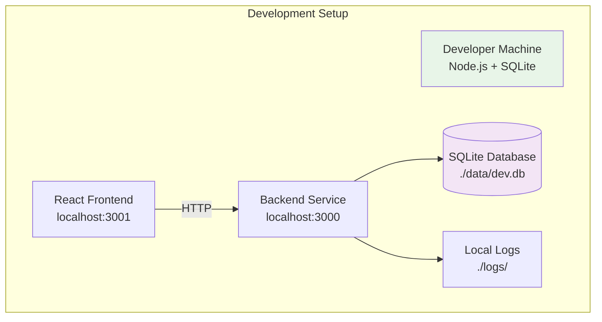
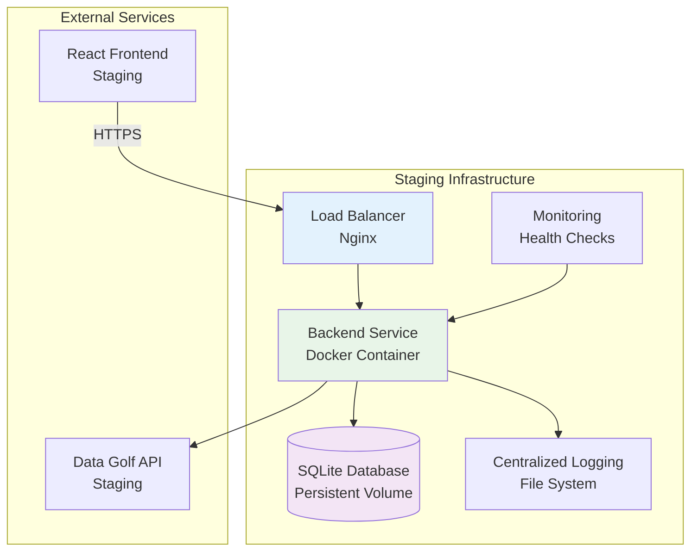
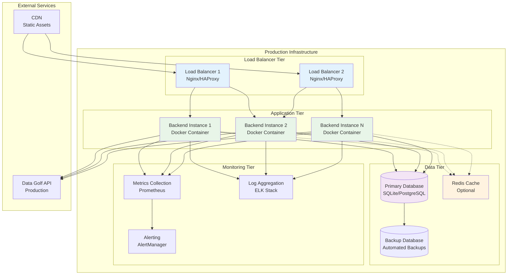

# Golf API Analytics Backend Service - Deployment Architecture

## Deployment Overview

The Golf API Analytics Backend Service is designed for flexible deployment across development, staging, and production environments. The architecture supports both single-node deployment for development and horizontally scalable deployment for production workloads.

## Environment Configurations

### Development Environment



**Development Configuration:**
```yaml
# docker-compose.dev.yml
version: '3.8'
services:
  golf-api-backend:
    build:
      context: .
      dockerfile: Dockerfile.dev
    ports:
      - "3000:3000"
    environment:
      - NODE_ENV=development
      - PORT=3000
      - DATABASE_PATH=./data/dev.db
      - LOG_LEVEL=debug
      - CACHE_MAX_SIZE=100MB
      - RATE_LIMIT_ENABLED=false
    volumes:
      - ./src:/app/src
      - ./data:/app/data
      - ./logs:/app/logs
    command: npm run dev
```

### Staging Environment



**Staging Configuration:**
```yaml
# docker-compose.staging.yml
version: '3.8'
services:
  nginx:
    image: nginx:alpine
    ports:
      - "80:80"
      - "443:443"
    volumes:
      - ./nginx/staging.conf:/etc/nginx/nginx.conf
      - ./ssl:/etc/ssl/certs
    depends_on:
      - golf-api-backend

  golf-api-backend:
    build:
      context: .
      dockerfile: Dockerfile.prod
    environment:
      - NODE_ENV=staging
      - PORT=3000
      - DATABASE_PATH=/data/staging.db
      - LOG_LEVEL=info
      - CACHE_MAX_SIZE=500MB
      - RATE_LIMIT_ENABLED=true
    volumes:
      - staging_data:/data
      - staging_logs:/logs
    healthcheck:
      test: ["CMD", "curl", "-f", "http://localhost:3000/api/v1/analytics/health"]
      interval: 30s
      timeout: 10s
      retries: 3

volumes:
  staging_data:
  staging_logs:
```

### Production Environment



## Container Architecture

### Multi-Stage Dockerfile

```dockerfile
# Dockerfile
# Stage 1: Build dependencies
FROM node:18-alpine AS dependencies
WORKDIR /app
COPY package*.json ./
RUN npm ci --only=production && npm cache clean --force

# Stage 2: Build application
FROM node:18-alpine AS builder
WORKDIR /app
COPY package*.json ./
RUN npm ci
COPY . .
RUN npm run build
RUN npm run test:unit

# Stage 3: Production runtime
FROM node:18-alpine AS runtime
WORKDIR /app

# Install security updates
RUN apk update && apk upgrade && apk add --no-cache dumb-init

# Create non-root user
RUN addgroup -g 1001 -S nodejs
RUN adduser -S golf-api -u 1001

# Copy built application
COPY --from=dependencies /app/node_modules ./node_modules
COPY --from=builder /app/dist ./dist
COPY --from=builder /app/package*.json ./

# Create data and logs directories
RUN mkdir -p /app/data /app/logs && \
    chown -R golf-api:nodejs /app

# Switch to non-root user
USER golf-api

# Health check
HEALTHCHECK --interval=30s --timeout=10s --start-period=5s --retries=3 \
  CMD node dist/healthcheck.js

# Expose port
EXPOSE 3000

# Start application with dumb-init
ENTRYPOINT ["dumb-init", "--"]
CMD ["node", "dist/server.js"]
```

### Development Dockerfile

```dockerfile
# Dockerfile.dev
FROM node:18-alpine
WORKDIR /app

# Install development dependencies
RUN apk add --no-cache git

# Copy package files
COPY package*.json ./
RUN npm install

# Copy source code
COPY . .

# Create directories
RUN mkdir -p data logs

# Expose port
EXPOSE 3000

# Start in development mode
CMD ["npm", "run", "dev"]
```

## Infrastructure as Code

### Docker Compose Production

```yaml
# docker-compose.prod.yml
version: '3.8'

services:
  nginx:
    image: nginx:alpine
    ports:
      - "80:80"
      - "443:443"
    volumes:
      - ./nginx/prod.conf:/etc/nginx/nginx.conf:ro
      - ./ssl:/etc/ssl/certs:ro
      - nginx_logs:/var/log/nginx
    depends_on:
      - golf-api-backend-1
      - golf-api-backend-2
    restart: unless-stopped
    networks:
      - frontend
      - backend

  golf-api-backend-1:
    build:
      context: .
      dockerfile: Dockerfile
    environment:
      - NODE_ENV=production
      - PORT=3000
      - INSTANCE_ID=backend-1
      - DATABASE_PATH=/data/production.db
      - LOG_LEVEL=warn
      - CACHE_MAX_SIZE=1GB
      - RATE_LIMIT_ENABLED=true
      - MASTER_ENCRYPTION_KEY_FILE=/run/secrets/encryption_key
      - SESSION_SECRET_FILE=/run/secrets/session_secret
    volumes:
      - prod_data:/data
      - prod_logs:/logs
    secrets:
      - encryption_key
      - session_secret
    healthcheck:
      test: ["CMD", "node", "dist/healthcheck.js"]
      interval: 30s
      timeout: 10s
      retries: 3
      start_period: 40s
    restart: unless-stopped
    networks:
      - backend
    deploy:
      resources:
        limits:
          memory: 512M
          cpus: '0.5'
        reservations:
          memory: 256M
          cpus: '0.25'

  golf-api-backend-2:
    build:
      context: .
      dockerfile: Dockerfile
    environment:
      - NODE_ENV=production
      - PORT=3000
      - INSTANCE_ID=backend-2
      - DATABASE_PATH=/data/production.db
      - LOG_LEVEL=warn
      - CACHE_MAX_SIZE=1GB
      - RATE_LIMIT_ENABLED=true
      - MASTER_ENCRYPTION_KEY_FILE=/run/secrets/encryption_key
      - SESSION_SECRET_FILE=/run/secrets/session_secret
    volumes:
      - prod_data:/data
      - prod_logs:/logs
    secrets:
      - encryption_key
      - session_secret
    healthcheck:
      test: ["CMD", "node", "dist/healthcheck.js"]
      interval: 30s
      timeout: 10s
      retries: 3
      start_period: 40s
    restart: unless-stopped
    networks:
      - backend
    deploy:
      resources:
        limits:
          memory: 512M
          cpus: '0.5'
        reservations:
          memory: 256M
          cpus: '0.25'

  redis:
    image: redis:7-alpine
    command: redis-server --appendonly yes --requirepass ${REDIS_PASSWORD}
    volumes:
      - redis_data:/data
    restart: unless-stopped
    networks:
      - backend
    deploy:
      resources:
        limits:
          memory: 256M
          cpus: '0.25'

  prometheus:
    image: prom/prometheus:latest
    ports:
      - "9090:9090"
    volumes:
      - ./monitoring/prometheus.yml:/etc/prometheus/prometheus.yml:ro
      - prometheus_data:/prometheus
    command:
      - '--config.file=/etc/prometheus/prometheus.yml'
      - '--storage.tsdb.path=/prometheus'
      - '--web.console.libraries=/etc/prometheus/console_libraries'
      - '--web.console.templates=/etc/prometheus/consoles'
    restart: unless-stopped
    networks:
      - monitoring

  grafana:
    image: grafana/grafana:latest
    ports:
      - "3001:3000"
    environment:
      - GF_SECURITY_ADMIN_PASSWORD=${GRAFANA_PASSWORD}
    volumes:
      - grafana_data:/var/lib/grafana
      - ./monitoring/grafana/dashboards:/etc/grafana/provisioning/dashboards:ro
      - ./monitoring/grafana/datasources:/etc/grafana/provisioning/datasources:ro
    restart: unless-stopped
    networks:
      - monitoring

volumes:
  prod_data:
    driver: local
    driver_opts:
      type: none
      o: bind
      device: /opt/golf-api/data
  prod_logs:
    driver: local
    driver_opts:
      type: none
      o: bind
      device: /opt/golf-api/logs
  redis_data:
  prometheus_data:
  grafana_data:
  nginx_logs:

networks:
  frontend:
    driver: bridge
  backend:
    driver: bridge
    internal: true
  monitoring:
    driver: bridge

secrets:
  encryption_key:
    file: ./secrets/encryption_key.txt
  session_secret:
    file: ./secrets/session_secret.txt
```

## Load Balancer Configuration

### Nginx Configuration

```nginx
# nginx/prod.conf
user nginx;
worker_processes auto;
error_log /var/log/nginx/error.log warn;
pid /var/run/nginx.pid;

events {
    worker_connections 1024;
    use epoll;
    multi_accept on;
}

http {
    include /etc/nginx/mime.types;
    default_type application/octet-stream;

    # Logging
    log_format main '$remote_addr - $remote_user [$time_local] "$request" '
                    '$status $body_bytes_sent "$http_referer" '
                    '"$http_user_agent" "$http_x_forwarded_for" '
                    'rt=$request_time uct="$upstream_connect_time" '
                    'uht="$upstream_header_time" urt="$upstream_response_time"';

    access_log /var/log/nginx/access.log main;

    # Performance
    sendfile on;
    tcp_nopush on;
    tcp_nodelay on;
    keepalive_timeout 65;
    types_hash_max_size 2048;
    client_max_body_size 10M;

    # Gzip compression
    gzip on;
    gzip_vary on;
    gzip_min_length 1024;
    gzip_types
        text/plain
        text/css
        text/xml
        text/javascript
        application/json
        application/javascript
        application/xml+rss
        application/atom+xml;

    # Rate limiting
    limit_req_zone $binary_remote_addr zone=api:10m rate=10r/s;
    limit_req_zone $binary_remote_addr zone=health:10m rate=1r/s;

    # Upstream backend servers
    upstream golf_api_backend {
        least_conn;
        server golf-api-backend-1:3000 max_fails=3 fail_timeout=30s;
        server golf-api-backend-2:3000 max_fails=3 fail_timeout=30s;
        keepalive 32;
    }

    # Health check endpoint
    server {
        listen 80;
        server_name health.golf-api.local;

        location /health {
            limit_req zone=health burst=5 nodelay;
            proxy_pass http://golf_api_backend/api/v1/analytics/health;
            proxy_set_header Host $host;
            proxy_set_header X-Real-IP $remote_addr;
            proxy_set_header X-Forwarded-For $proxy_add_x_forwarded_for;
            proxy_set_header X-Forwarded-Proto $scheme;
            proxy_connect_timeout 5s;
            proxy_send_timeout 10s;
            proxy_read_timeout 10s;
        }
    }

    # Main API server
    server {
        listen 80;
        listen 443 ssl http2;
        server_name api.golf-analytics.com;

        # SSL configuration
        ssl_certificate /etc/ssl/certs/golf-api.crt;
        ssl_certificate_key /etc/ssl/certs/golf-api.key;
        ssl_protocols TLSv1.2 TLSv1.3;
        ssl_ciphers ECDHE-RSA-AES256-GCM-SHA512:DHE-RSA-AES256-GCM-SHA512:ECDHE-RSA-AES256-GCM-SHA384:DHE-RSA-AES256-GCM-SHA384;
        ssl_prefer_server_ciphers off;
        ssl_session_cache shared:SSL:10m;
        ssl_session_timeout 10m;

        # Security headers
        add_header X-Frame-Options DENY;
        add_header X-Content-Type-Options nosniff;
        add_header X-XSS-Protection "1; mode=block";
        add_header Strict-Transport-Security "max-age=31536000; includeSubDomains" always;

        # CORS headers
        add_header Access-Control-Allow-Origin "https://golf-api-builder.com";
        add_header Access-Control-Allow-Methods "GET, POST, PUT, DELETE, OPTIONS";
        add_header Access-Control-Allow-Headers "Origin, X-Requested-With, Content-Type, Accept, Authorization, X-Session-ID, X-Request-ID";
        add_header Access-Control-Allow-Credentials true;

        # Handle preflight requests
        if ($request_method = 'OPTIONS') {
            add_header Access-Control-Allow-Origin "https://golf-api-builder.com";
            add_header Access-Control-Allow-Methods "GET, POST, PUT, DELETE, OPTIONS";
            add_header Access-Control-Allow-Headers "Origin, X-Requested-With, Content-Type, Accept, Authorization, X-Session-ID, X-Request-ID";
            add_header Access-Control-Allow-Credentials true;
            add_header Content-Length 0;
            add_header Content-Type text/plain;
            return 204;
        }

        # API endpoints
        location /api/ {
            limit_req zone=api burst=20 nodelay;

            proxy_pass http://golf_api_backend;
            proxy_set_header Host $host;
            proxy_set_header X-Real-IP $remote_addr;
            proxy_set_header X-Forwarded-For $proxy_add_x_forwarded_for;
            proxy_set_header X-Forwarded-Proto $scheme;
            proxy_set_header X-Request-ID $request_id;

            # Timeouts
            proxy_connect_timeout 30s;
            proxy_send_timeout 60s;
            proxy_read_timeout 60s;

            # Buffering
            proxy_buffering on;
            proxy_buffer_size 4k;
            proxy_buffers 8 4k;
            proxy_busy_buffers_size 8k;

            # Keep-alive
            proxy_http_version 1.1;
            proxy_set_header Connection "";
        }

        # Health check
        location /health {
            limit_req zone=health burst=5 nodelay;
            proxy_pass http://golf_api_backend/api/v1/analytics/health;
            proxy_set_header Host $host;
            proxy_set_header X-Real-IP $remote_addr;
            proxy_set_header X-Forwarded-For $proxy_add_x_forwarded_for;
            proxy_set_header X-Forwarded-Proto $scheme;
            proxy_connect_timeout 5s;
            proxy_send_timeout 10s;
            proxy_read_timeout 10s;
        }

        # Redirect HTTP to HTTPS
        if ($scheme != "https") {
            return 301 https://$server_name$request_uri;
        }
    }
}
```

## Monitoring and Observability

### Prometheus Configuration

```yaml
# monitoring/prometheus.yml
global:
  scrape_interval: 15s
  evaluation_interval: 15s

rule_files:
  - "rules/*.yml"

alerting:
  alertmanagers:
    - static_configs:
        - targets:
          - alertmanager:9093

scrape_configs:
  - job_name: 'golf-api-backend'
    static_configs:
      - targets: ['golf-api-backend-1:3000', 'golf-api-backend-2:3000']
    metrics_path: '/api/v1/analytics/metrics/prometheus'
    scrape_interval: 30s
    scrape_timeout: 10s

  - job_name: 'nginx'
    static_configs:
      - targets: ['nginx:9113']
    scrape_interval: 30s

  - job_name: 'redis'
    static_configs:
      - targets: ['redis:6379']
    scrape_interval: 30s

  - job_name: 'node-exporter'
    static_configs:
      - targets: ['node-exporter:9100']
    scrape_interval: 30s
```

### Health Check Implementation

```typescript
// src/healthcheck.ts
import http from 'http';
import { performance } from 'perf_hooks';

interface HealthCheckResult {
  status: 'healthy' | 'warning' | 'critical';
  timestamp: number;
  checks: {
    [component: string]: {
      status: 'healthy' | 'warning' | 'critical';
      responseTime: number;
      details?: any;
    };
  };
}

async function performHealthCheck(): Promise<HealthCheckResult> {
  const startTime = performance.now();
  const result: HealthCheckResult = {
    status: 'healthy',
    timestamp: Date.now(),
    checks: {}
  };

  // Database health check
  try {
    const dbStart = performance.now();
    // Perform simple database query
    await checkDatabase();
    result.checks.database = {
      status: 'healthy',
      responseTime: performance.now() - dbStart
    };
  } catch (error) {
    result.checks.database = {
      status: 'critical',
      responseTime: performance.now() - startTime,
      details: error.message
    };
    result.status = 'critical';
  }

  // Cache health check
  try {
    const cacheStart = performance.now();
    await checkCache();
    result.checks.cache = {
      status: 'healthy',
      responseTime: performance.now() - cacheStart
    };
  } catch (error) {
    result.checks.cache = {
      status: 'warning',
      responseTime: performance.now() - cacheStart,
      details: error.message
    };
    if (result.status === 'healthy') {
      result.status = 'warning';
    }
  }

  // External API health check
  try {
    const apiStart = performance.now();
    await checkExternalAPI();
    result.checks.externalAPI = {
      status: 'healthy',
      responseTime: performance.now() - apiStart
    };
  } catch (error) {
    result.checks.externalAPI = {
      status: 'warning',
      responseTime: performance.now() - apiStart,
      details: error.message
    };
    if (result.status === 'healthy') {
      result.status = 'warning';
    }
  }

  return result;
}

async function checkDatabase(): Promise<void> {
  // Implementation depends on database layer
  // Should perform a simple query to verify connectivity
}

async function checkCache(): Promise<void> {
  // Implementation depends on cache layer
  // Should verify cache read/write operations
}

async function checkExternalAPI(): Promise<void> {
  // Check Data Golf API connectivity
  // Should be a lightweight endpoint check
}

// Main health check execution
async function main(): Promise<void> {
  try {
    const result = await performHealthCheck();

    if (result.status === 'healthy') {
      console.log('Health check passed');
      process.exit(0);
    } else {
      console.error('Health check failed:', JSON.stringify(result, null, 2));
      process.exit(1);
    }
  } catch (error) {
    console.error('Health check error:', error);
    process.exit(1);
  }
}

if (require.main === module) {
  main();
}

export { performHealthCheck };
```

## Security Configuration

### Environment Variables

```bash
# .env.production
NODE_ENV=production
PORT=3000

# Database
DATABASE_PATH=/data/production.db
DATABASE_BACKUP_PATH=/backups/
DATABASE_BACKUP_RETENTION_DAYS=30

# External API
DATA_GOLF_API_URL=https://feeds.datagolf.com
DATA_GOLF_API_TIMEOUT=30000
DATA_GOLF_API_RETRY_ATTEMPTS=3

# Security (loaded from files in production)
MASTER_ENCRYPTION_KEY_FILE=/run/secrets/encryption_key
SESSION_SECRET_FILE=/run/secrets/session_secret

# Cache
CACHE_MAX_SIZE=1073741824  # 1GB
CACHE_DEFAULT_TTL=3600     # 1 hour
CACHE_COMPRESSION_ENABLED=true

# Rate Limiting
RATE_LIMIT_ENABLED=true
RATE_LIMIT_WINDOW_MS=60000  # 1 minute
RATE_LIMIT_MAX_REQUESTS=100

# Logging
LOG_LEVEL=warn
LOG_FORMAT=json
LOG_MAX_FILES=10
LOG_MAX_SIZE=100MB

# Monitoring
METRICS_ENABLED=true
HEALTH_CHECK_INTERVAL=30000  # 30 seconds
PERFORMANCE_MONITORING=true

# CORS
CORS_ORIGIN=https://golf-api-builder.com
CORS_CREDENTIALS=true

# SSL/TLS
SSL_CERT_PATH=/etc/ssl/certs/golf-api.crt
SSL_KEY_PATH=/etc/ssl/certs/golf-api.key
```

### Secret Management

```bash
# scripts/generate-secrets.sh
#!/bin/bash

# Create secrets directory
mkdir -p ./secrets

# Generate encryption key (256-bit)
openssl rand -hex 32 > ./secrets/encryption_key.txt

# Generate session secret (256-bit)
openssl rand -hex 32 > ./secrets/session_secret.txt

# Set proper permissions
chmod 600 ./secrets/*.txt

echo "Secrets generated successfully"
echo "Encryption key: $(cat ./secrets/encryption_key.txt)"
echo "Session secret: $(cat ./secrets/session_secret.txt)"
```

## Backup and Recovery

### Database Backup Strategy

```bash
# scripts/backup-database.sh
#!/bin/bash

BACKUP_DIR="/backups"
DATABASE_PATH="/data/production.db"
RETENTION_DAYS=30
TIMESTAMP=$(date +%Y%m%d_%H%M%S)

# Create backup directory
mkdir -p "$BACKUP_DIR"

# Create database backup
sqlite3 "$DATABASE_PATH" ".backup $BACKUP_DIR/golf_api_backup_$TIMESTAMP.db"

# Compress backup
gzip "$BACKUP_DIR/golf_api_backup_$TIMESTAMP.db"

# Remove old backups
find "$BACKUP_DIR" -name "golf_api_backup_*.db.gz" -mtime +$RETENTION_DAYS -delete

echo "Database backup completed: golf_api_backup_$TIMESTAMP.db.gz"
```

### Automated Backup with Cron

```bash
# Add to crontab
# Backup database every 6 hours
0 */6 * * * /opt/golf-api/scripts/backup-database.sh >> /var/log/golf-api-backup.log 2>&1

# Weekly backup verification
0 2 * * 0 /opt/golf-api/scripts/verify-backup.sh >> /var/log/golf-api-backup-verify.log 2>&1
```

## Scaling Strategies

### Horizontal Scaling

```yaml
# docker-compose.scale.yml
version: '3.8'

services:
  golf-api-backend:
    build:
      context: .
      dockerfile: Dockerfile
    environment:
      - NODE_ENV=production
      - DATABASE_PATH=/data/production.db
      - REDIS_URL=redis://redis:6379
    volumes:
      - shared_data:/data
    deploy:
      replicas: 5
      update_config:
        parallelism: 2
        delay: 10s
        order: start-first
      restart_policy:
        condition: on-failure
        delay: 5s
        max_attempts: 3
      resources:
        limits:
          memory: 512M
          cpus: '0.5'
        reservations:
          memory: 256M
          cpus: '0.25'

volumes:
  shared_data:
    driver: local
    driver_opts:
      type: nfs
      o: addr=nfs-server,rw
      device: ":/opt/golf-api/data"
```

### Auto-scaling with Docker Swarm

```bash
# Deploy with auto-scaling
docker stack deploy -c docker-compose.scale.yml golf-api

# Scale based on CPU usage
docker service update --replicas 3 golf-api_golf-api-backend

# Auto-scale script
#!/bin/bash
CPU_THRESHOLD=70
CURRENT_REPLICAS=$(docker service ls --filter name=golf-api_golf-api-backend --format "{{.Replicas}}" | cut -d'/' -f1)
CPU_USAGE=$(docker stats --no-stream --format "table {{.CPUPerc}}" | tail -n +2 | sed 's/%//' | awk '{sum+=$1} END {print sum/NR}')

if (( $(echo "$CPU_USAGE > $CPU_THRESHOLD" | bc -l) )); then
    NEW_REPLICAS=$((CURRENT_REPLICAS + 1))
    docker service update --replicas $NEW_REPLICAS golf-api_golf-api-backend
    echo "Scaled up to $NEW_REPLICAS replicas (CPU: $CPU_USAGE%)"
fi
```

## Performance Optimization

### Production Optimizations

```typescript
// src/config/production.ts
export const productionConfig = {
  // Node.js optimizations
  nodeOptions: [
    '--max-old-space-size=512',
    '--optimize-for-size',
    '--gc-interval=100'
  ],

  // Express optimizations
  express: {
    trustProxy: true,
    compression: {
      level: 6,
      threshold: 1024
    },
    helmet: {
      contentSecurityPolicy: {
        directives: {
          defaultSrc: ["'self'"],
          styleSrc: ["'self'", "'unsafe-inline'"],
          scriptSrc: ["'self'"],
          imgSrc: ["'self'", "data:", "https:"]
        }
      }
    }
  },

  // Database optimizations
  database: {
    connectionPool: {
      min: 2,
      max: 10,
      acquireTimeoutMillis: 30000,
      idleTimeoutMillis: 30000
    },
    pragmas: [
      'PRAGMA journal_mode = WAL',
      'PRAGMA synchronous = NORMAL',
      'PRAGMA cache_size = 1000',
      'PRAGMA temp_store = memory'
    ]
  },

  // Cache optimizations
  cache: {
    maxSize: 1024 * 1024 * 1024, // 1GB
    compressionThreshold: 1024,
    compressionLevel: 6,
    ttlVariation: 0.1 // 10% TTL variation to prevent thundering herd
  }
};
```

This comprehensive deployment architecture provides a robust foundation for deploying the Golf API Analytics Backend Service across all environments, with proper security, monitoring, and scaling capabilities.
